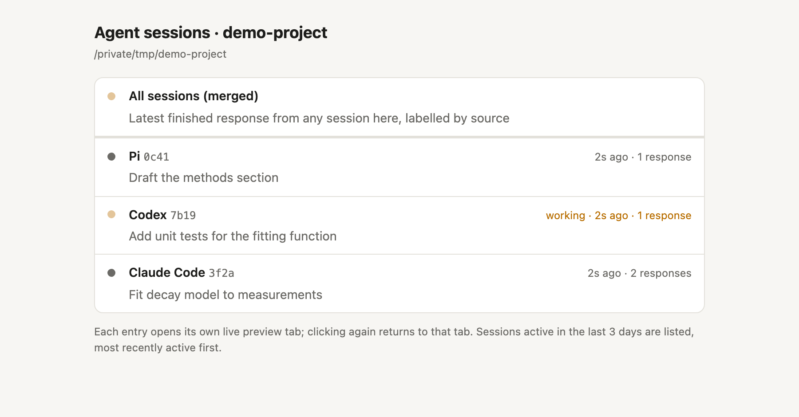
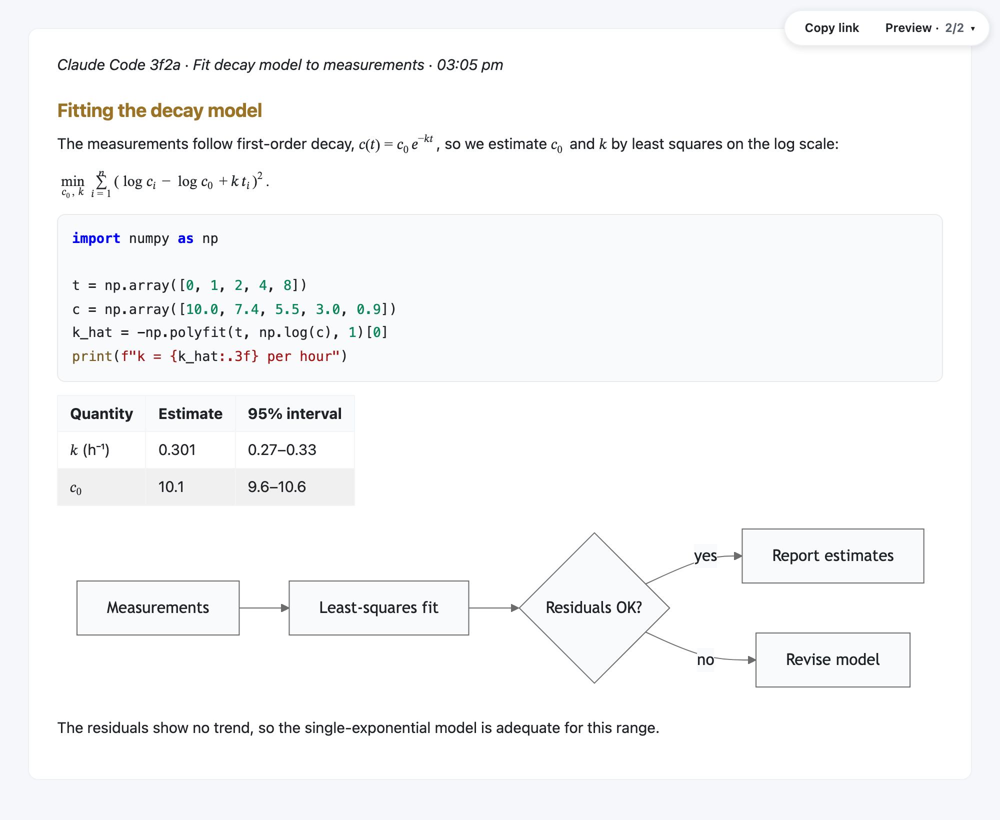
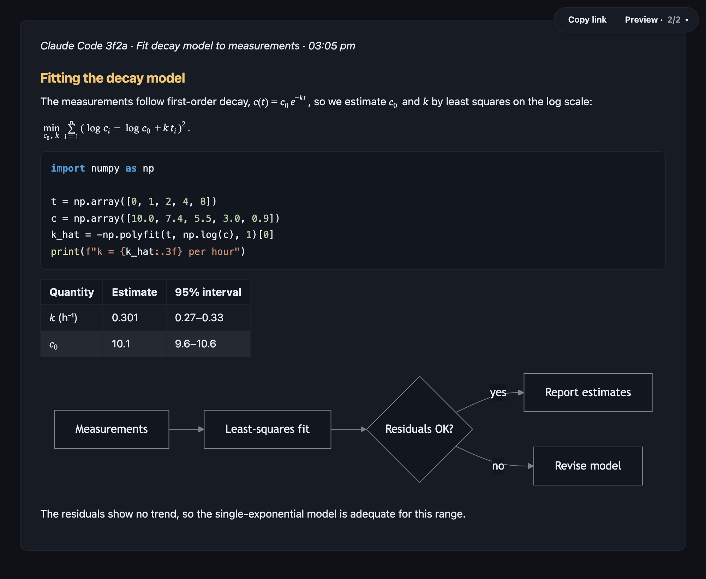

# agent-markdown-preview

Preview coding-agent responses and local Markdown, LaTeX, code and diff files in the browser, with math rendering, syntax highlighting, Mermaid diagrams and light/dark styling. It works alongside [Claude Code](https://docs.claude.com/en/docs/claude-code), [Codex](https://github.com/openai/codex) and [Pi](https://pi.dev) by reading the session logs each agent already writes.

## Screenshots

**Session index for a project:**



**A response preview, following the system light/dark setting:**

| Light | Dark |
|:--:|:--:|
|  |  |

## Features

- **Session index** — lists the recently active Claude Code, Codex and Pi sessions for a project with their titles, whether a turn is in progress and when each was last active. Sessions started later appear automatically.
- **Live response previews** — each session opens in its own tab and updates when the agent finishes a turn. A merged view shows the latest response from any session, labelled by source.
- **History** — each preview starts with the session's recent responses, so you can step back through them straight away.
- **File previews** — preview a Markdown, LaTeX, code or diff file and follow its changes.
- **Rendering** — Pandoc-based Markdown and LaTeX with math, syntax highlighting, tables, Mermaid diagrams, local images and `[an: ...]` annotation markers, using the same renderer as [pi-markdown-preview](https://github.com/omaclaren/pi-markdown-preview).
- **Themes** — pages follow the system light/dark setting as it changes, using the default palettes or the [pi-studio](https://github.com/omaclaren/pi-studio) light and dark themes. Fixed themes and Pi theme files also work.
- **Restarts** — previews keep their local addresses, so open tabs reconnect when the command restarts.

## Requirements

- Node.js 22 or later
- [Pandoc](https://pandoc.org/installing.html) (`brew install pandoc` on macOS). Set `PANDOC_PATH` if it is not on your `PATH`.
- A web browser. Mermaid diagrams, the MathJax fallback for some equations and PDF figures load pinned modules from jsDelivr or unpkg the first time a page needs them, so those features need network access.

agent-markdown-preview is developed and tested on macOS. It should also work on Linux, which has had less testing; Windows is untested.

## Install

```bash
npm install -g agent-markdown-preview
```

Or run it without installing:

```bash
npx agent-markdown-preview
```

## Usage

Run the command in the project directory where you are working with an agent:

| Command | Description |
|---------|-------------|
| `agent-markdown-preview` | Open the session index for the current directory |
| `agent-markdown-preview --merged` | Open one preview showing the latest response from any session here |
| `agent-markdown-preview --session <path>` | Preview a single session log |
| `agent-markdown-preview <file>` | Preview a Markdown, LaTeX, code or diff file and follow its changes |

| Option | Description |
|--------|-------------|
| `--agent claude,codex,pi` | Agents to follow (default: all) |
| `--cwd <dir>` | Project directory whose sessions to follow (default: current directory) |
| `--history <n>` | Earlier responses each preview starts with (default 10, maximum 20; 0 shows only the latest) |
| `--theme <name\|file>` | `auto` (default) or `pi-studio` follows the system light/dark setting; `light`, `dark`, `pi-studio-light`, `pi-studio-dark` or a Pi theme `.json` file fixes the theme |
| `--font-size <px>` | Base font size |
| `--open` | Open a browser tab even when restarting at a remembered address |
| `--no-open` | Never open a browser tab; still print the URL |

### Sessions and previews

The index lists sessions whose logs changed in the last three days, up to eight per agent, most recently active first. Each entry shows the agent, a short session ID, the session title and when the session was last active. The title is the agent's own title for the session when it has one, and otherwise the first prompt. An entry marked **working** has a turn in progress. The index checks for new sessions every two seconds, including the new log an agent starts after `/clear`.

Selecting a session opens its preview in a new tab, and the index marks sessions whose preview has checked in recently. Suspended or heavily throttled background tabs may lose the **open** marker until they check in again. A preview updates when the agent finishes a turn and shows the final response of that turn, which is the text the agent writes after its last tool call. A small caption above each response names the agent, session and time, for example *Claude Code 3f2a · Fit decay model to measurements · 03:05 pm*. **All sessions (merged)** shows the most recent finished response from any session in the directory.

Active preview tabs check for new rendered responses every 200 ms using small, short-lived requests. Background tabs check less often and check immediately when brought to the foreground. Unchanged responses are not re-rendered or reloaded, and opening multiple tabs does not reserve a permanent connection per tab. Previous/Next navigation does not wait for a check.

Local images in responses are resolved against the project directory; absolute paths and web images also work.

### Local document links

Click a link to a local Markdown, LaTeX, or common text/code file to open a rendered preview in another tab. Absolute paths (including files outside the project), relative paths, and local `file://` URLs work. Spaces and section anchors are preserved. Relative links in agent responses use the monitored project directory; links and images inside a file use that file's directory.

Linked documents are **snapshots**: refresh to reread the file, or preview the file itself (`agent-markdown-preview <file>`) for continuous updates. This first version accepts UTF-8 text files up to 2 MiB; PDF, Office and other binary document links are not handled. If an old linked tab expires, reopen it from its source preview. Web links and same-page section links are unchanged.

### History and navigation

Each preview starts with the last 10 finished responses from the session log, with the newest shown. The merged view takes the last 10 across all sessions, in time order. `--history` changes this count, and a page keeps up to 20 revisions as new responses arrive.

Use **Previous**, **Next** and **Latest** in the **Preview** panel, or **Option/Alt+Left** and **Option/Alt+Right**; adding **Shift** jumps to the oldest or latest revision. While you are viewing the latest revision the page follows new responses. On an older revision it stays put and marks **Latest (new)** when something arrives.

File previews start with the current version of the file and add a revision each time it changes. They keep your reading position across updates.

### Restarts

Each preview keeps the same local address when the command restarts, and previews that were open during the last day are started again. Open tabs therefore reconnect by themselves, and the history is rebuilt from the session logs. While the command is stopped, a tab shows a disconnected status beside its controls.

A new address opens in your browser automatically. **Restarting at a remembered address does not open another tab**, even if an old tab is suspended or has been closed. Use `--open` when you want a tab opened explicitly, or open the printed URL. `--no-open` suppresses automatic opening even for a new address. This applies to the index, merged/session previews and file previews.

Addresses are remembered in `~/.agent-markdown-preview/servers.json`; set `AGENT_MARKDOWN_PREVIEW_HOME` to use another directory. If another program has taken a remembered port, the preview starts on a new port and you reopen it from the index.

### Themes

With `--theme auto` (the default), pages follow the browser's light/dark setting, which normally follows the operating system, and switch as soon as it changes. They use pi-markdown-preview's default light and dark palettes. `--theme pi-studio` does the same with the light and dark themes from pi-studio. Pages with Mermaid diagrams reload so the diagrams are redrawn in the new colours.

`--theme light`, `dark`, `pi-studio-light` or `pi-studio-dark` fixes the theme, as does the path of a Pi theme `.json` file. Pi themes are resolved as Pi resolves them, so the colours match pi-markdown-preview inside Pi with the same theme.

### How responses are found

Each agent writes its session to a JSONL file. agent-markdown-preview reads these files and leaves them unchanged; it needs no configuration in the agents themselves.

| Agent | Session logs | Final response of a turn |
|---|---|---|
| Claude Code | `~/.claude/projects/<directory>/*.jsonl` (respects `CLAUDE_CONFIG_DIR`) | the assistant message that ends the turn (`stop_reason: end_turn`), with its text blocks joined |
| Codex | `~/.codex/sessions/YYYY/MM/DD/rollout-*.jsonl` (respects `CODEX_HOME`), matched by the working directory recorded in each file | `task_complete` event, `last_agent_message` |
| Pi | `~/.pi/agent/sessions/--<directory>--/*.jsonl` | assistant message with `stopReason: "stop"` |

Subagent messages are skipped. These log formats are internal to each agent and can change between releases. Entries the tool does not recognise are ignored, so a format change shows up as missing previews rather than errors. OpenCode and Gemini CLI sessions are not supported yet.

### Security

The index and every preview listen only on `127.0.0.1`. Each has its own random token, which the page exchanges for a browser cookie on first load. Anyone with a preview's link can read that preview, and the index link lists your sessions, so treat these links as private. The **Copy link** control produces a fresh link for another browser. The remembered-addresses file contains the tokens and is readable only by you.

A preview serves its rendered pages, their referenced images/PDFs, and supported text documents explicitly linked from retained responses or recently opened documents. These routes require the preview's cookie; there is no directory browser or arbitrary file-path endpoint. Anyone with the original preview link can also follow its local document links, including links outside the project, so share it only with that access in mind. Following a session does not automatically expose its log file. HTML files linked as documents are displayed as code, not run as web pages.

## Relationship to pi-markdown-preview

agent-markdown-preview uses the browser renderer and watch page from [pi-markdown-preview](https://github.com/omaclaren/pi-markdown-preview), extracted so they run without Pi. Inside Pi, use pi-markdown-preview itself: it also provides terminal image previews, PDF export and colours from your Pi theme.

## Development

```bash
npm install
npm test            # builds, then runs all tests
npm run typecheck
```

The source is TypeScript in `src/`, compiled to `dist/`. Setting `PUPPETEER_EXECUTABLE_PATH` to a Chromium build, such as `chrome-headless-shell`, also runs a real-browser test of light/dark switching.

### Keeping the renderer identical

`src/render.ts` is generated from pi-markdown-preview and should not be edited by hand. With a pi-markdown-preview checkout beside this one:

```bash
npm run extract     # regenerate src/render.ts from ../pi-markdown-preview
cp ../pi-markdown-preview/client/* src/client/ && cp ../pi-markdown-preview/shared/*.{js,lua} src/shared/
npm test
```

`scripts/extract-render-core.cjs` uses the TypeScript compiler to copy the top-level declarations the browser renderer depends on, verbatim and in their original order, replacing only Pi's `Theme` type with a structural equivalent. The files in `src/client` and `src/shared` are copied unchanged, currently from pi-markdown-preview 0.18.0. `src/themes` holds unchanged copies of pi-studio's theme files. `test/equivalence.test.mjs` renders pi-markdown-preview's test fixtures and a code file in both themes and checks that the HTML is byte-identical to pi-markdown-preview's output. It uses `../pi-markdown-preview`, or the path in `AMP_REFERENCE`, and is skipped when neither is available.

## License

MIT
